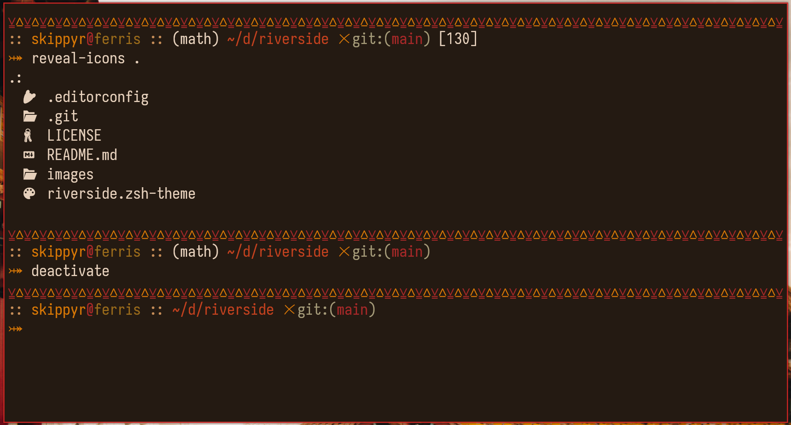

# Riverside

## Description

A more portable and simpler version of my other theme: [River Dreams](https://github.com/skippyr/river-dreams).



> **Note**
>
> The theme may look different in your setup as its appearance depends of what
> colors and font you are using for your terminal emulator. Use the preview as
> just a reference.
>
> Theme used for terminal emulator is [Flamerial](https://github.com/skippyr/flamerial).

Here is the description of its design:
-	Shows your user and host names.
-	Sourced virtual environments will appear inside parenthesis.
-	If inside a Gir repository, it shows the current branch. If there are changes
	to be commited, it will prefix it with an `x` symbol.
-	If your last command failed, its exit code will be shown.

## Installation

### Dependencies

The following dependencies must be installed to run this software:

| Dependency | Description |
|-|-|
| `git` | Required to retrive information about Git repositories. |
| [Noto Font](https://fonts.google.com/noto/specimen/Noto+Sans) | Provides the required pretty symbols. |

### Manual Procedures

Use the following instructions to install this theme manually.

-	Run the following command inside of a terminal emulator to install the theme.
```bash
git clone --depth=1 https://github.com/skippyr/riverside\
                    ~/.local/share/zsh/themes/riverside &&
echo "source ~/.local/share/zsh/themes/riverside/riverside.zsh-theme" >>\
     ~/.zshrc
```

-	Reopen the terminal emulator to load the theme.

### Procedures With OhMyZSH

Use the following instructions to install this theme for OhMyZSH.

-	Run the following command inside of a terminal emulator to install the theme.

```bash
git clone --depth=1 https://github.com/skippyr/riverside\
                    ${ZSH_CUSTOM:-${HOME}/.oh-my-zsh/custom}/themes/riverside
```

-	Change the value of the `ZSH_THEME` variable in your ZSH configuration file,
	`~/.zshrc`, to use the theme:

```bash
ZSH_THEME=riverside/riverside
```

-	Reopen your terminal emulator to load the theme.

## Support

Report issues, questions and suggestion through the [issues tab](https://github.com/skippyr/riverside/issues).

## Copyright

This software is distributed under the MIT License. A copy of the license is
bundled with the source code.

Copyright (c) 2023, Sherman Rofeman. MIT license.

