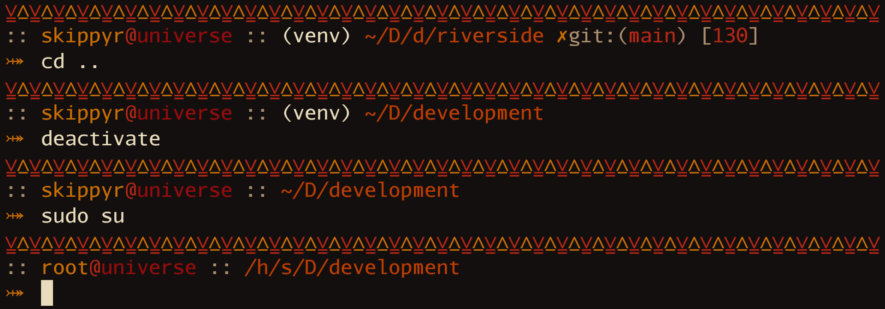

# Riverside

## Starting Point

The Riverside project is a theme for the ZSH shell that is inspired by the
`robbyrussel` and `kafeitu` themes. It is also a more portable version of
my old theme: [River Dreams](https://github.com/skippyr/river_dreams).



> In this preview, the Riverside theme was used within the [Kitty terminal emulator](https://github.com/kovidgoyal/kitty)
> with the [Flamerial theme](https://github.com/skippyr/flamerial). Font is
> [Iosevka](https://github.com/be5invis/Iosevka) (variant `ss08`).

## Features

This theme can show you the following information:

-   The exit code of failed commands.
-   Your user and hostname.
-   The name of sourced virtual environments.
-   Your current directory path abbreviated.
-   If inside a Git repository, the name of the branch and if has changes to be
    commited.

## Dependencies

This theme has some dependencies that you need to download before installing it.

-   git

    This is the terminal utility used to obtain information about your Git
    repositories.

## Installation

You can install this theme in multiple ways, use the one that suits you best.

### Manually

-   Run the following command to install the theme at
    `~/.local/share/zsh/themes/riverside`.

    ```bash
    git clone --depth=1 https://github.com/skippyr/riverside ~/.local/share/zsh/themes/riverside &&
    echo "source \"${HOME}/.local/share/zsh/themes/riverside/riverside.zsh-theme\"" >> ~/.zshrc
    ```

-   Reopen your terminal emulator.

### Within OhMyZSH

-   Install the theme in OhMyZSH custom themes' directory.

    ```bash
    git clone --depth=1 https://github.com/skippyr/riverside ${ZSH_CUSTOM:-${HOME}/.oh-my-zsh/custom}/themes/riverside
    ```

-   Change the value of the `ZSH_THEME` variable in your ZSH configuration file,
    `~/.zshrc`, to use the theme.

    ```bash
    ZSH_THEME="riverside/riverside"
    ```

-   Reopen your terminal emulator.

## Issues And Suggestions

Report issues and suggestions through the [issues tab](https://github.com/skippyr/riverside/issues).

## License

This project is released under the terms of the MIT license. A copy of the
license is bundled with the source code.

Copyright (c) 2023, Sherman Rofeman. MIT license.
